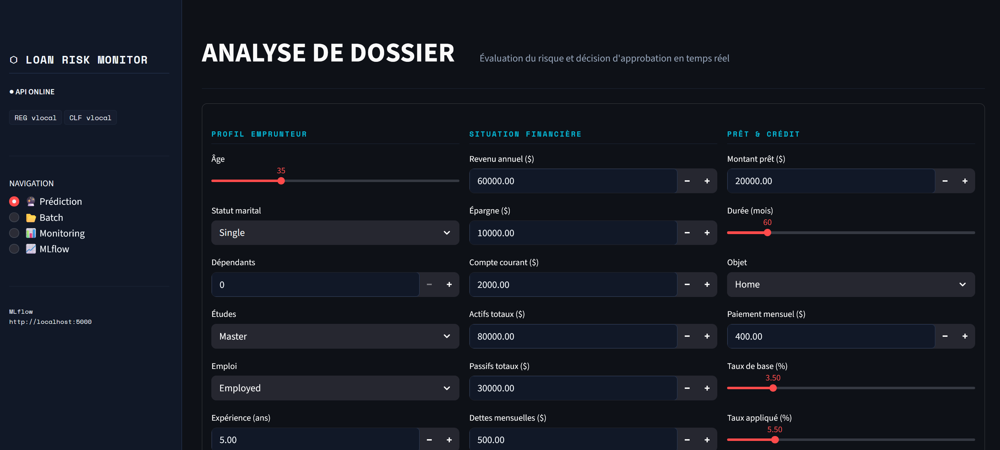
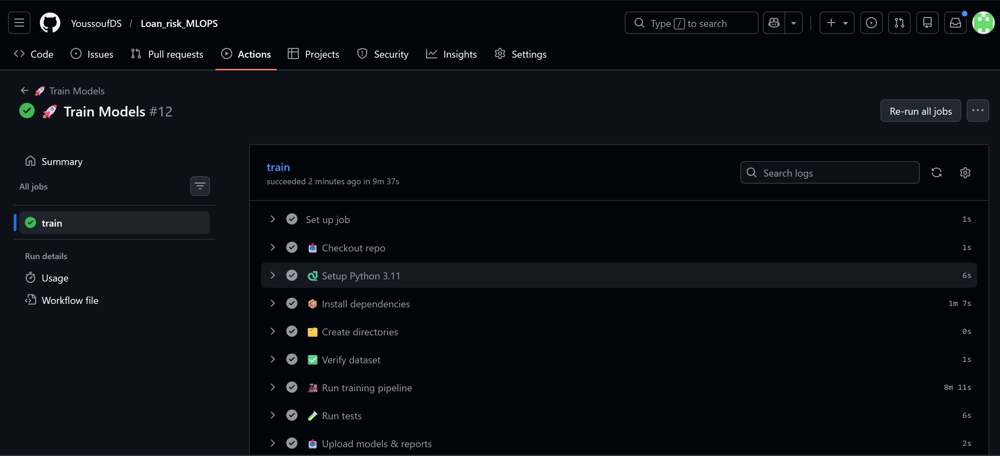
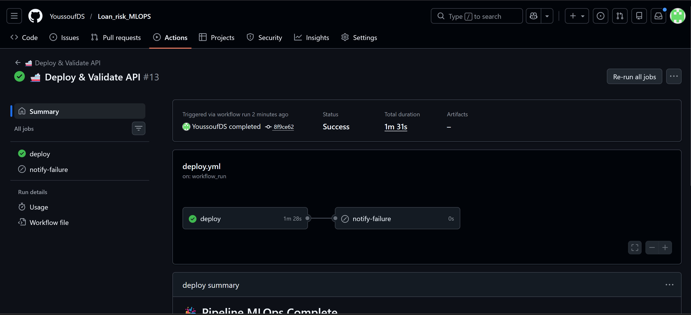
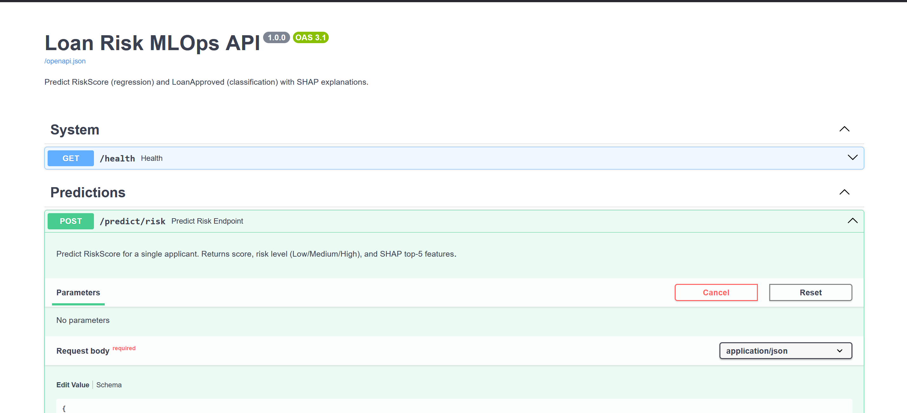
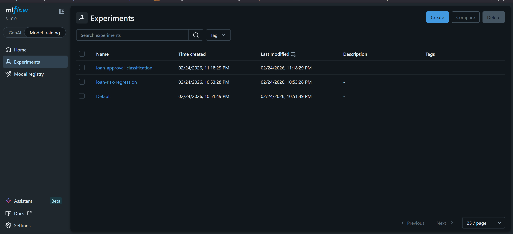
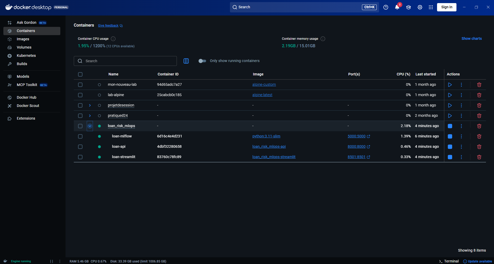

# 🏦 Loan Risk MLOps

> Pipeline MLOps complet pour la prédiction de risque de prêt bancaire — scoring, approbation, explicabilité SHAP, monitoring de drift et déploiement automatisé.

[](https://github.com/YoussoufDS/Loan_risk_MLOPS/actions/workflows/train.yml)
[](https://github.com/YoussoufDS/Loan_risk_MLOPS/actions/workflows/deploy.yml)


---

## Stack

`LightGBM · XGBoost · CatBoost · Optuna · MLflow · FastAPI · Streamlit · Docker · GitHub Actions · SHAP`

---

## Résultats

| Modèle | Métrique | Valeur |
|--------|----------|--------|
| WeightedEnsemble | RMSE | **2.2335** |
| WeightedEnsemble | R² | **0.9209** |
| WeightedEnsemble | AUC | **0.9937** |
| WeightedEnsemble | F1 | **0.9261** |

---

## Screenshots

### Dashboard Streamlit


### GitHub Actions — Train Models


### GitHub Actions — Deploy & Validate


### FastAPI — Swagger UI


### MLflow — Experiments


### Docker Desktop — Containers


---

## Démarrage rapide

```bash
# 1. Cloner et installer
git clone https://github.com/YoussoufDS/Loan_risk_MLOPS.git
cd Loan_risk_MLOPS
pip install -r requirements.txt

# 2. Entraîner les modèles
python -m src.train --data data/raw/Loan.csv --trigger manual

# 3. Lancer MLflow (terminal 1)
mlflow server --backend-store-uri sqlite:///mlruns/mlflow.db --host 127.0.0.1 --port 5000

# 4. Lancer l'API (terminal 2)
uvicorn api.main:app --host 0.0.0.0 --port 8000 --reload

# 5. Lancer le dashboard (terminal 3)
streamlit run frontend/app.py
```

### Avec Docker (recommandé)

```bash
docker-compose up --build
```

| Service | URL |
|---------|-----|
| MLflow | http://localhost:5000 |
| API Swagger | http://localhost:8000/docs |
| Dashboard | http://localhost:8501 |

---

## Architecture

```
Loan_risk_MLOPS/
├── src/
│   ├── train.py             # Orchestrateur principal + MLflow logging
│   ├── preprocessing.py     # Feature engineering + nested 5-split
│   ├── ensemble.py          # WeightedEnsemble (Hill Climbing)
│   ├── evaluate.py          # Métriques + SHAP
│   ├── drift_detection.py   # PSI + auto-trigger retrain
│   └── utils.py
├── api/
│   ├── main.py              # FastAPI — 6 endpoints
│   ├── predict.py           # Inférence + preprocessing
│   └── schemas.py           # Validation Pydantic
├── frontend/
│   └── app.py               # Streamlit — 4 pages
├── .github/workflows/
│   ├── train.yml            # Entraînement automatique
│   ├── deploy.yml           # Déploiement + validation
│   ├── retrain.yml          # CRON hebdo + drift trigger
│   └── drift_check.yml      # CRON quotidien 6h UTC
├── Dockerfile               # Image API (multi-stage)
├── Dockerfile.streamlit     # Image Dashboard
├── docker-compose.yml       # Orchestration 3 services
└── config.yaml              # Configuration centralisée
```

---

## Endpoints API

| Méthode | Endpoint | Description |
|---------|----------|-------------|
| GET | `/health` | Statut API + versions modèles |
| POST | `/predict/risk` | RiskScore + niveau + SHAP top-5 |
| POST | `/predict/approval` | LoanApproved + probabilité + SHAP |
| POST | `/predict/batch` | Upload CSV → CSV enrichi |
| GET | `/model/info` | Métadonnées modèles actifs |
| POST | `/model/reload` | Rechargement depuis MLflow Registry |

---

## Pipeline CI/CD

```
Push sur main/src/
       ↓
 🚀 Train Models (~12min)
       ↓ si succès
 🚢 Deploy & Validate (~10min)

─────────────────────────

Chaque jour 6h UTC
       ↓
 🔍 Drift Detection (~5min)
       ↓ si PSI > 0.2 sur 3+ features
 🔄 Retrain Models (~12min)
       ↓ si succès
 🚢 Deploy & Validate (~10min)
```

---

## Décisions techniques clés

**Nested split 5 partitions** — prévient toute contamination entre phases d'optimisation :

| Partition | Taille | Usage |
|-----------|--------|-------|
| Train | 60% | Entraînement des modèles |
| Val-A | 10% | Early stopping uniquement |
| Val-B | 10% | Optuna (500 trials) uniquement |
| Val-C | 10% | Hill Climbing uniquement |
| Test | 10% | Évaluation finale — touché une seule fois |

**WeightedEnsemble (Hill Climbing)** — poids optimaux calculés automatiquement sur Val-C en combinant LightGBM, XGBoost et CatBoost.

**Drift → Retrain automatique** — si PSI > 0.2 sur ≥ 3 features, `drift_check.yml` déclenche `retrain.yml` automatiquement.

---

## Auteur

**YoussoufDS** — [github.com/YoussoufDS/Loan_risk_MLOPS](https://github.com/YoussoufDS/Loan_risk_MLOPS)